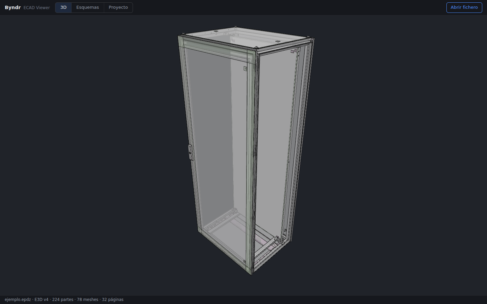
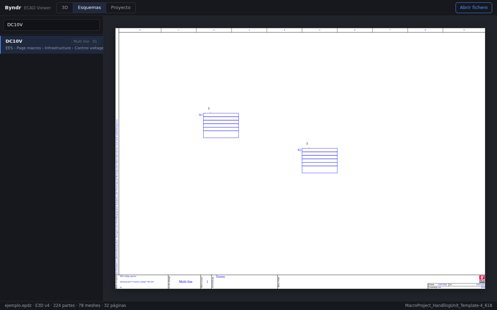
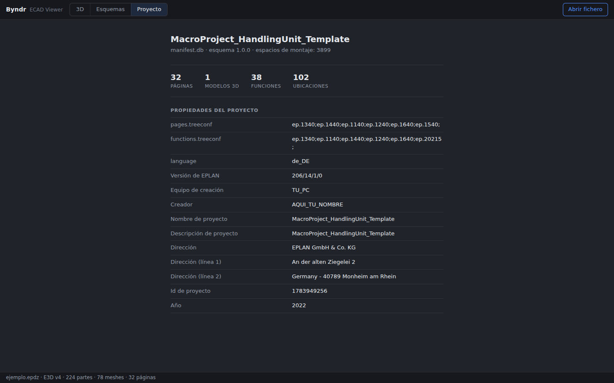
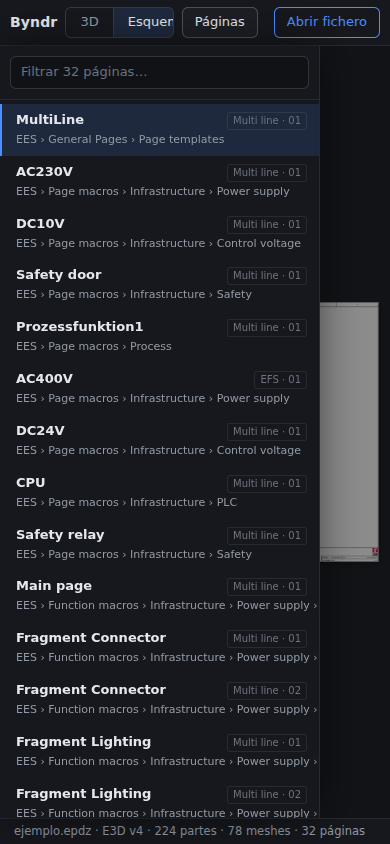

# Byndr ECAD Project Viewer

An open-source, browser-based viewer for **EPLAN** electrical CAD projects.
Open `.epdz` project exports and `.e3d` 3D parts directly in your browser —
no EPLAN installation, no server, no upload. Everything is parsed and
rendered locally on your device, on desktop and mobile.

> **Disclaimer:** this is an independent community project. It is not
> affiliated with, endorsed by, or supported by EPLAN GmbH & Co. KG.
> EPLAN is a trademark of its respective owner.

| 3D models | Schematic pages |
| --- | --- |
|  |  |

| Project info (SQLite manifest) | Mobile |
| --- | --- |
|  |  |

## Features

- **`.epdz` support** — EPLAN project exports are opened fully client-side
  (they are 7-zip archives, extracted in the browser with WebAssembly).
- **3D viewer** — interprets the proprietary binary **E3D** format (versions
  1–4) and renders it with three.js: faces with per-group materials,
  transparency, edge/contour lines, textures and text labels. Orbit, zoom
  and part picking (with EPLAN `typeId` / `objectId` metadata).
- **2D schematics** — renders the project's SVG pages with pan, wheel zoom,
  pinch-zoom and double-tap refit. EPLAN's embedded scripting is sanitized
  and relative resources are resolved from inside the archive.
- **Cross-reference navigation** — the original `jumpToFunction` links in the
  schematics are turned into in-app navigation: click a symbol or cross
  reference to jump between the occurrences of a device, with the target
  framed and highlighted.
- **Device search** — a device index is built from the symbols of all pages;
  search a device and jump to (and cycle through) its occurrences.
- **Project tree** — hierarchical structure navigation (functional
  assignment, location…) built from the `manifest.db` structured
  identifiers, next to the flat page list.
- **Project metadata from SQLite** — reads the archive's `manifest.db`
  (via sql.js) to show the real project structure: structured page names
  and breadcrumbs, project properties (creator, company, EPLAN version…),
  functions, locations, and the mapping from installation spaces to 3D
  models.
- **Cross-platform by design** — one TypeScript codebase; responsive UI for
  desktop and mobile browsers. The app installs as a **PWA** (offline
  support via service worker), and thin native shells for desktop (Tauri)
  and mobile (Capacitor) wrap the same web core — see
  [`docs/native-shells.md`](docs/native-shells.md).
- **Privacy-friendly** — files never leave your device.

## Quick start

Requires Node.js ≥ 20.

```bash
npm install
npm run dev            # build the core and start the viewer (Vite dev server)
```

Then open the printed URL and drag in a `.epdz` or `.e3d` file, or use the
bundled demo files.

Other commands:

```bash
npm run build          # full production build (packages/e3d-core + apps/web)
npm run test:samples   # parse the sample E3D files and validate the interpreter
```

## Repository layout

```
packages/e3d-core/   The format library (TypeScript, no UI):
                       reader.ts    E3D binary parser (v1-v4)
                       epdz.ts      .epdz extraction (7z-wasm)
                       manifest.ts  manifest.db reader (sql.js / SQLite)
                       three/       E3D scene -> three.js builder
apps/web/            The viewer app (Vite + React + three.js). Installable
                     as a PWA (manifest + service worker).
apps/desktop/        Tauri desktop shell wrapping apps/web (Rust toolchain).
apps/mobile/         Capacitor mobile shell wrapping apps/web (own install).
samples/             Sample files: a .epdz project export (EPLAN demo
                     content) and a standalone .e3d part.
docs/                Format documentation and screenshots.
scripts/             Development scripts (parser smoke test).
reference/           Historical reverse-engineering material and early
                     prototypes. Not part of the build. See reference/README.md.
```

## File formats

Detailed notes live in [`docs/formats.md`](docs/formats.md):

- **`.e3d`** — little-endian binary scene format: header (version, view,
  background colors), then length-prefixed arrays of lights, textures
  (uncompressed BGRA), meshes (interleaved vertex buffer + face/edge groups
  with OpenGL-style primitive modes) and parts (mesh instance + 4x4
  transform + color + text labels). Z-up.
- **`.epdz`** — a **7-zip** archive containing `manifest.db` (SQLite project
  database), `packages/pages/**/*.svg` (schematic pages),
  `packages/installationspaces/**/*.E3d` (3D) and AutomationML.

## Roadmap / ideas

- [x] Cross-reference navigation in schematics (the original `jumpToFunction`
      links between pages).
- [x] Device search & highlight across pages.
- [x] Project tree navigation from `manifest.db` functions and locations.
- [x] Better 3D text-label placement (justification fidelity).
- [x] Native shells: Capacitor (iOS/Android) and Tauri (desktop), wrapping
      the same web core — see [`docs/native-shells.md`](docs/native-shells.md).
- [x] PWA manifest + offline support.

Ideas for the future:

- [ ] Interruption-point navigation (`page_interruptionpoints`) and richer
      cross-reference targets.
- [ ] AutomationML-based project tree (functions/locations beyond what
      `manifest.db` exposes).
- [ ] Measuring tools and exploded view in the 3D viewer.

Contributions welcome — see [CONTRIBUTING.md](CONTRIBUTING.md).

## License

[MIT](LICENSE). Sample project data in `samples/` originates from EPLAN's
publicly distributed demo/template content and is included solely for
development and testing of the format support.
