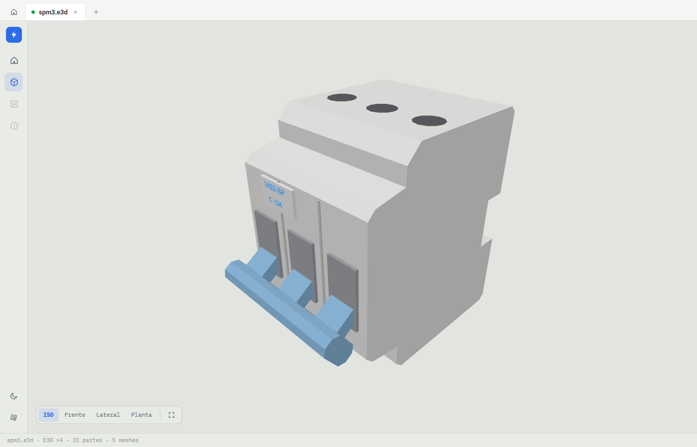
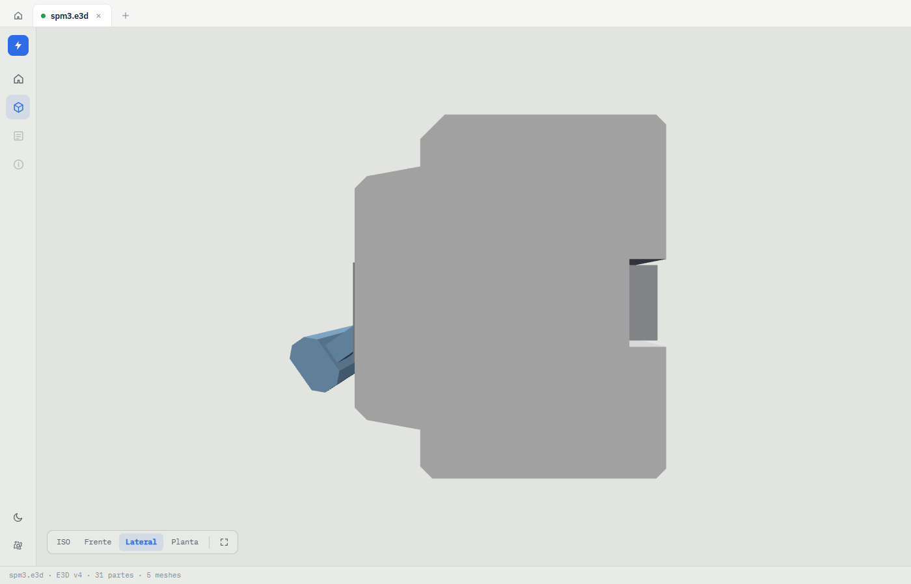

# Asset creator

Programmatic 3D asset generation for this project: build models from code
(primitive composition, low-poly flat-shaded) and export them as

- **`.e3d`** — the EPLAN binary format this repo's viewer renders
  (round-trip compatible with the `@covaga/e3d-core` parser), and
- **`.stl`** — binary STL, for use in CAD/mesh tools.

This is companion tooling; nothing here ships with the web app.

## Status

The core library and **Phase 0 (CLI + agent skill)** are **done and working**.
The AI-facing creator/viewer integrates spec JSON + `create.mjs` + `preview.mjs`
and the agent skill in `.claude/skills/asset-creator/SKILL.md`.
The electrical-component generator catalog and 2D-engine export are
**planned** — see [`TODO.md`](TODO.md).

## Layout

```
lib/geometry.mjs      primitives (sphere/cone/cylinder/box/torus), 2D-profile
                      extrusion with chamfers (extrudeTris/prism), vectors,
                      flat-shaded meshing, and the composable Scene API
lib/spec.mjs          declarative layer spec validator and Scene builder
lib/e3d-writer.mjs    Scene -> E3D v4 binary (mirror of e3d-core's reader)
lib/stl-writer.mjs    Scene -> binary STL (transforms baked, normals rebuilt)
cli/create.mjs        spec JSON -> .e3d/.stl + .layers.json sidecar
cli/preview.mjs       .e3d -> PNG by angle (iso/front/side/top, headless
                      playwright + esbuild bundle in tmpdir, caché-d)
docs/spec.md          complete JSON spec reference (params, layers, repeat, ops)
examples/contactor.mjs parametric DIN-rail contactor (Scene API script)
examples/spm3.spec.json 7-layer 3-pole protector spec (31 parts, 876 triangles)
examples/spm3.mjs     same protector as Scene API script (legacy)
todo/                 design notes for the planned work
.claude/skills/asset-creator/SKILL.md  agent workflow and reference
```

Plain ESM JavaScript, no build step, no dependencies — runs with `node`.

## Quickstart

```bash
node tools/asset-creator/examples/contactor.mjs
# -> examples/out/contactor.e3d + contactor.stl
node tools/asset-creator/examples/spm3.mjs
# -> examples/out/spm3.e3d + spm3.stl
```

Open the `.e3d` in the web viewer (`npm run dev`, then drop the file) to
inspect it. Verify any generated file against the real parser:

```js
import { parseE3d } from "../../packages/e3d-core/dist/index.js";
parseE3d(buffer); // throws unless the whole file parses cleanly
```

## Scene API in 30 seconds

```js
import { Scene } from "./lib/geometry.mjs";
import { writeE3d } from "./lib/e3d-writer.mjs";
import { writeStl } from "./lib/stl-writer.mjs";

const s = new Scene();
s.box([0, 0, 30], [40, 20, 60], [0.8, 0.8, 0.8]); // center, size, RGB
s.tube([0, -12, 50], [0, -18, 50], 3, [0.7, 0.7, 0.75]); // from, to, radius
s.ball([0, -20, 50], [4, 4, 4], [0.9, 0.5, 0.1], { transparency: 0.4 });
// 2D profile [[y,z], ...] (CCW, concavities and chamfers allowed),
// extruded along X — for real housing profiles instead of stacked boxes
s.prism([[-10, 0], [10, 0], [10, 18], [7, 21], [-10, 21]], 0, 40, [0.9, 0.9, 0.9]);
writeE3d(s); // Buffer
writeStl(s); // Buffer
```

Coordinates are EPLAN-style: **Z up, millimetres**; the viewer's default
camera looks at the scene from the −Y side, so "front" faces −Y.

## Layered spec workflow

For AI agents or iterative modeling, use the **declarative JSON spec** instead
of writing Scene API code:

```bash
# Write or edit a spec (params, layers, repeat, ops)
$EDITOR my-part.spec.json

# Generate .e3d and .layers.json sidecar
node tools/asset-creator/cli/create.mjs my-part.spec.json

# Render PNGs to inspect what was built
node tools/asset-creator/cli/preview.mjs out/my-part.e3d

# Adjust only the layer(s) that need fixing, regenerate, repeat
```

**Full spec format reference:** [`docs/spec.md`](docs/spec.md) (params, layers,
repeat, all op types). **Agent workflow and gotchas:**
[`.claude/skills/asset-creator/SKILL.md`](../../.claude/skills/asset-creator/SKILL.md).

## From a 2D drawing to 3D

`examples/spm3.mjs` models a 3-pole DIN-rail supplementary protector
(1492-SP family) from the manufacturer's 2D dimension drawing. The source
PDF is proprietary and **not** included in the repo; the workflow is what
matters:

1. **Render each drawing view separately at high resolution** (~600 dpi)
   instead of reading the whole sheet at once — small details (handle
   shape, recessed terminal funnels, chamfers) are invisible at low res.
   pdfjs-dist driving a headless browser works well for cropping views.
2. **Map every dimension to an axis explicitly**, cross-checking views.
   For the spm3: 52.20 = width (3 × 17.4 per pole), 74.64 = height,
   50.30 = body depth, 63.70 = depth incl. the front band, 88.00 = depth
   incl. the toggle. Ambiguous dimensions deserve a note, not a guess.
3. **Trace the side profile as a 2D polygon** (with chamfers and the DIN
   notch) and extrude it with `Scene.prism` — one part that instantly
   matches the drawing's side view, instead of a pile of boxes.
4. **Verify before shipping**: load the `.e3d` in the viewer and compare
   the Front/Side/Top camera presets against the drawing views.

Result (viewer screenshots, ISO and side view):




